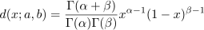

# 1. Requirements

Write a handwritten digit classifier for the MNIST database. These are composed of 70000 28x28 pixel gray-scale images
of handwritten digits divided into 60000 training set and 10000 test set.

Train the following classifiers on the dataset:

* SVM using linear, polynomial of degree 2, and RBF kernels;
* Random forests
* Naive Bayes classifier where each pixel is distributed according to a Beta distribution of parameters &alpha;,
  &beta;: 
* k-NN

Use 10 way cross validation to optimize the parameters for each classifier.

# 2. Introduction

# 3. Deisgn the solution

## 3.1. SVM

There are several hyperparameters that we can tune:

* `C`: This is the regularization parameter, also known as the cost parameter. This tells the SVM optimization how much
  we want to avoid misclassifying each training example. A smaller value of C creates a wider margin, which may allow
  more misclassifications. A larger C creates a narrower margin and thus may reduce the number of misclassifications.

* `kernel`: This specifies the kernel type to be used in the algorithm. It could be 'linear', 'poly', 'rbf', 'sigmoid',
  or a custom function.

* `degree`: This is the degree of the polynomial kernel function ('poly') and is ignored by all other kernels. It
  essentially controls the complexity of the model.

* `gamma`: This defines how far the influence of a single training example reaches, with low values meaning 'far' and
  high values meaning 'close'. It can be seen as the inverse of the radius of influence of samples selected by the model
  as support vectors.

* `coef0`: This is the independent term in the kernel function. It is only significant in 'poly' and 'sigmoid'. If gamma
  is 0, then coef0 controls the bias effect. Otherwise, the larger gamma is, the higher the bias and the lower the
  variance.

In the process of hyperparameter tuning, we use a combination of trial repetition and cross-validation by adjusting the
`n_trials` and `cv` parameters of the classifier:

* `n_trials`: The number of trials to run per hyperparameter set. In each trial, a different set of hyperparameters is
  chosen and used to train the model. The performance of the model is then evaluated. This process is repeated for the
  specified number of trials, with the goal of finding the set of hyperparameters that gives the best performance.

* `cv`: The number of folds to use for cross-validation. Each subset serves as the validation set for the model trained
  on the remaining data. This helps in assessing the performance of the model with the given set of hyperparameters.

### 3.1.1. Linear kernel

#### 3.1.1.1. Formalization

Both `LinearSVC` and `SVC(kernel='linear')` can be used for binary classification problems. The choice between the two
often depends on the size of the dataset and the specific requirements of the problem:

* `LinearSVC`: it uses a one-vs-rest strategy for multi-class problems, but for binary classification, this distinction
  does
  not matter. It can be faster to train on large datasets because it scales linearly with the number of data points.

* `SVC(kernel='linear')`: it uses a one-vs-one strategy for multi-class problems. For binary classification, this is
  equivalent to one-vs-rest. But `SVC(kernel='linear')` can be slower on large datasets because the training time scales
  quadratically with the number of data points.

In terms of the decision boundary, both `LinearSVC` and `SVC(kernel='linear')` will produce the same results because
they both use a linear kernel.

So, if the dataset is large, `LinearSVC` might be a better choice due to its efficiency.

